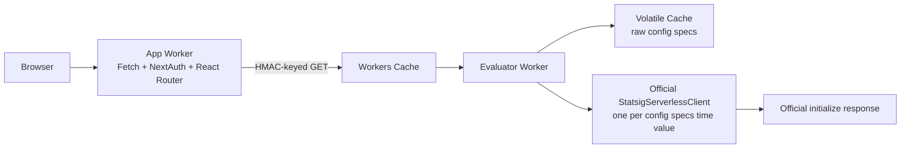

# Implementation plan

## Objective

Keep the deployable two-Worker reference architecture while using Statsig's
official evaluation implementation and a native Fetch request path.

## Architecture



The application demonstrates:

- React Router's native Fetch request handler and streaming Web responses.
- Literal `next-auth` 4.24.15.
- React Router framework-mode SSR.
- A private Service Binding.
- Workers Cache on the evaluator entrypoint only.
- Volatile Cache for large raw Statsig config specs.
- Official Statsig gate, config, experiment, and layer evaluation.
- Browser bootstrap initialization with all Statsig network traffic disabled.
- HMAC-partitioned per-user bootstrap caching.

## Statsig evaluator

The evaluator imports `StatsigServerlessClient` from the root
`@statsig/serverless-client` package. It does not use the Cloudflare wrapper,
`handleWithStatsig`, `StatsigCloudflareClient.initializeFromKV()`, or KV.

The config specs repository:

1. Fetches `download_config_specs` with the server secret.
2. Stores `{ rawJson, expiresAt }` in the Volatile Cache binding.
3. Reads the config specs time from the top-level `time` field.
4. Creates one isolate-local `StatsigServerlessClient` for that config specs
   time.
5. Calls the public data adapter's `setData(rawJson)` and `initializeSync()`.
6. Retains the initialized client, config specs time, and expiry, but not
   `rawJson`, in the runtime snapshot.
7. Reuses the client until the absolute cached expiry.
8. Replaces the client when the config specs time changes.
9. Falls back to the last-known-good client when a TTL reload fails.

Evaluation calls:

```ts
client.getClientInitializeResponse(user, {
	clientSDKKey: env.STATSIG_CLIENT_KEY,
	hash: 'none',
});
```

The result is passed through a permissive wire-contract validator that
preserves official response fields and is returned to the application Worker.

## Config specs expiry and invalidation

Normal freshness is lazy TTL expiry. There is no periodic refresh cron and no
endpoint that claims to refresh while serving an older cached value.

`POST /admin/invalidate` requires `INVALIDATION_SECRET` and performs two
repository invalidations: it deletes the Volatile Cache config specs key and
clears the isolate-local snapshot. The next evaluator
invocation after the per-user Workers Cache entry expires downloads and
initializes the current config specs. Bootstrap entries continue to obey their
declared Workers Cache TTL and stale window.

## Browser integration

The browser uses only the public `@statsig/js-client` API:

```ts
const client = new StatsigClient(clientKey, user, {
	loggingEnabled: 'disabled',
	networkConfig: { preventAllNetworkTraffic: true },
});

client.dataAdapter.setData(JSON.stringify(bootstrap));
client.initializeSync();
```

No `@statsig/js-client/src/*` import is used.

## NextAuth compatibility capsule

`workers/app/compat/next-auth-bridge.ts` exposes a bridge with only:

```ts
interface NextAuthBridge {
	handle(request: Request): Promise<Response>;
	loadSession(request: Request): Promise<{
		headers: Headers;
		session: Session | null;
	}>;
}
```

The capsule:

- Resolves the CommonJS exports once at module initialization through one typed,
  single-level interop helper.
- Converts the incoming Fetch request into a separate explicit NextAuth request.
- Parses JSON and URL-encoded endpoint request bodies with a 32 KiB limit.
- Collects NextAuth's Node-shaped response methods into a native Web `Response`.
- Preserves array-valued `Set-Cookie` headers.
- Is contract-tested against the exact pinned `next-auth` 4.24.15 package.

## Native React Router request path

The application Worker calls `createRequestHandler()` from `react-router`
directly with the incoming Fetch `Request` and a `RouterContextProvider`.
Health and NextAuth endpoints are dispatched before React Router. App-wide
headers and session cookies are applied by constructing a new `Response` around
the original body stream; the body is never read or buffered. The server entry
returns React's `ReadableStream` without awaiting `allReady`, enabling shell
streaming and removing the Node HTTP bridge lifecycle mismatch.

## Configuration

The application Worker and evaluator Worker use the same `APP_ID` and
`STATSIG_CLIENT_KEY`. The evaluator additionally requires:

- `STATSIG_SERVER_SECRET`
- `USER_CACHE_HMAC_SECRET`
- `INVALIDATION_SECRET`

The Volatile Cache binding remains experimental and is configured with a
64 MiB maximum value and 128 MiB total capacity for the representative 30 MB
config specs. Workers KV is intentionally not used because its documented value
limit is 25 MiB. `package.json` overrides the Vite plugin's Miniflare dependency
to the same workers-sdk PR build as Wrangler so the binding is present during
multi-Worker Vite development.

## Verification

The implementation is complete when all of these pass:

```sh
npm run cf-typegen
npm run check
npm run build
npx wrangler deploy --dry-run
npx wrangler deploy --dry-run --config wrangler.statsig.jsonc
```

Tests cover official server-side evaluation, browser bootstrap initialization,
absolute TTL behavior, config specs replacement, stale fallback, explicit
invalidation, HMAC cache keys, the pinned NextAuth bridge contract, multiple
`Set-Cookie` headers, and preservation of incremental response streaming.
