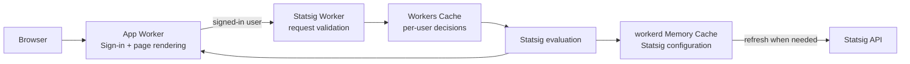

# Cloudflare Workers reference application

This project shows how a Cloudflare Workers application can use a separate,
private Worker to evaluate Statsig feature flags.

The **app Worker** handles sign-in, React Router server-side rendering, and the
user interface. When a signed-in page needs a feature decision, it calls the
**Statsig Worker** through a Service Binding. The Statsig Worker evaluates the
user and returns application-level decisions without exposing its Statsig
secret to the app Worker.

The repository demonstrates:

- Vite 8 and React Router 8 server-side rendering.
- Native Fetch request handling and streaming Web `Response` bodies.
- `next-auth` 4.24.15 behind a compatibility bridge, with `@auth/core`
  documented as an alternative.
- A private Statsig service reached through a Service Binding.
- Per-user Statsig decisions cached with Workers Cache.
- Downloaded Statsig configuration kept in workerd's shared
  [Memory Cache](https://github.com/cloudflare/workerd/blob/main/src/workerd/api/memory-cache.h).
- Server-side evaluation through `@statsig/serverless-client` 3.33.3.

## How it works



1. The browser sends a request to the app Worker.
2. The app Worker loads the session and renders the page.
3. If the page needs feature data for a signed-in user, the app Worker calls the
   Statsig Worker through the private `FEATURE_SERVICE` binding.
4. Workers Cache returns a stored decision when possible. On a cache miss, the
   Statsig Worker evaluates the user and returns a new decision.
5. The app Worker uses that decision while rendering the response.

The Statsig Worker exposes three entrypoints:

| Entrypoint | What it does | Cached? |
| --- | --- | --- |
| `default` | Reports service health | No |
| `FeatureGatewayEntrypoint` | Validates and prepares user data from the app | No |
| `DecisionCacheEntrypoint` | Evaluates and caches the Statsig decision | Yes |

The app binds only to `FeatureGatewayEntrypoint`. The gateway calls
`DecisionCacheEntrypoint` internally, which keeps the caching implementation
out of the app-facing service contract.

See [Statsig feature-service architecture](./docs/architecture/feature-service.md)
for the request format, entrypoint flow, cache keys, failure behavior, and the
reason this service uses `fetch()` rather than a custom RPC method.

## Caching

The Statsig Worker uses two caches for different jobs:

| Cache | Stores | Purpose |
| --- | --- | --- |
| Workers Cache | A Statsig decision for one user | Avoids repeating the same evaluation while the decision is fresh |
| workerd Memory Cache | Downloaded Statsig configuration | Allows isolates using the same cache in one workerd process to reuse the configuration |

`ctx.props` is part of the Workers Cache key, so different users receive
separate cached decisions. User IDs and email addresses are not placed in the
cache URL or structured evaluation logs.

The Memory Cache is process-local and is not durable storage. Its entries may
expire or be evicted. If a configuration refresh fails, an isolate that already
has a valid configuration can continue using that last-known-good copy.

The two caches refresh independently, so a Statsig change may take time to
appear in every decision. See the
[feature-service cache behavior](./docs/architecture/feature-service.md#cache-behavior)
for the exact freshness and stale-response rules.

## Statsig exposure reporting

The Statsig Worker reports the automatic `reference_gate` exposure only when
`STATSIG_EXPOSURE_LOGGING_ENABLED` is exactly `true`. Production and staging
enable it; local development explicitly disables it.

An exposure is attempted asynchronously after a successful GET evaluation on a
Workers Cache miss. Cache hits bypass the decision entrypoint, so they are not
additional exposures. HEAD requests and the currently unused `welcome_config`
do not generate exposures.

Exposure delivery is best-effort and never delays or changes a successful
decision response. Exposure counts therefore represent evaluated gate
decisions, not page views or confirmed feature use. Record actual use with a
separate product event.

Normalized email is available to Statsig targeting under `privateAttributes`
and is removed by the SDK before exposure events are sent.

## Experimental Memory Cache requirement

The workerd Memory Cache binding used by the Statsig Worker is experimental.
Local development therefore uses the Wrangler prerelease built from
[cloudflare/workers-sdk#14868](https://github.com/cloudflare/workers-sdk/pull/14868).
The package override in `package.json` also makes the Cloudflare Vite plugin use
that PR's Miniflare build.

Deployed Workers attach the account-level `volatile-cache-test` binding grant.
That grant injects the `CACHE` binding; the Worker must not also upload a direct
`volatile_cache` binding. During `vite` development, `vite.config.ts` replaces
the deployment-only grant with a local `volatile_cache` binding.

The binding is not yet part of Wrangler's public schema or generated types, so
`types/statsig-config-specs-cache.d.ts` provides its small
`read(key, fallback)` TypeScript contract.

## Authentication

The app uses the public `next-auth` 4.24.15 Next.js-style API through a small
compatibility bridge.

New Workers integrations should also consider `@auth/core`, which accepts a Web
`Request` and returns a Web `Response` directly. See the
[NextAuth v4 bridge documentation](./workers/app/compat/README.md) for a
comparison, migration notes, and implementation details.

## Schema validation

Runtime contracts are written with Zod. Production builds and the main test
suites compile an allowlisted set of schemas into validator functions. This
reduces the Zod setup that each Worker isolate performs at startup.

Local Vite development and the dedicated fallback test use regular Zod. Deploy
through the repository scripts: deploying `wrangler.statsig.jsonc` directly
skips the Vite build and schema compilation.

See [Build-time Zod schema compilation](./docs/architecture/schema-compilation.md)
for the compiler configuration, measurements, tests, and upgrade process.

## Local setup

Use Node.js 24 and the repository-pinned pnpm 11 release.

1. Install dependencies:

   ```sh
   pnpm install --frozen-lockfile
   ```

2. Create local secrets:

   ```sh
   cp .dev.vars.example .dev.vars
   pnpm run hash-password -- 'choose-a-demo-password'
   ```

   Copy the generated value into `DEMO_PASSWORD_HASH`. The shared local
   `.dev.vars` file supplies both Workers. In deployed environments,
   `STATSIG_SERVER_SECRET` belongs only to the Statsig Worker.

3. Start both Workers:

   ```sh
   pnpm run dev
   ```

4. Open the displayed URL and visit `/api/auth/signin`.

## Verification

```sh
pnpm run cf-typegen
pnpm run check
pnpm run build
pnpm run measure:worker-bundles
pnpm exec wrangler deploy --dry-run
pnpm exec wrangler deploy --dry-run --config dist/reference_example_kitchen_sink_statsig/wrangler.json
```

## Preview deployments

Each trusted pull request receives:

- a stable Preview URL that points to its latest successful Preview deployment;
- an immutable Deployment URL for one exact build.

The Preview app calls the deployed staging Statsig Worker. A service binding
from a Preview cannot target another Worker's Preview, so Statsig Worker changes
must be deployed to staging before the app Preview can use them.

CI tests and builds both Workers, updates the app Preview, runs the authentication
smoke test, and posts the URLs on the pull request.

See [Preview deployment workflow](./docs/deployments/previews.md) for one-time
setup, secrets, CI behavior, manual commands, authentication details, and
cleanup.

## Production releases

Test Statsig Worker changes in staging first. After the app Preview has been
approved, deploy the production Statsig Worker before the production app. This
prevents the app from depending on a feature-service contract that has not
reached production yet.

See [Production release workflow](./docs/deployments/production.md) for the full
release order, secret setup, and security checklist.

## Troubleshooting

- **Repeated `Cf-Cache-Status: MISS`:** confirm `FEATURE_SERVICE` targets the
  correct Statsig Worker, then review the internal entrypoint and cache-key flow
  in the [feature-service architecture guide](./docs/architecture/feature-service.md).
- **Missing authentication cookies:** use HTTPS outside local development. For
  Previews, verify `AUTH_TRUST_HOST=true` and remove any stale Preview
  `NEXTAUTH_URL` secret.
- **Preview reports missing bindings or secrets:** Preview settings are separate
  from production. Follow the
  [Preview setup checklist](./docs/deployments/previews.md#one-time-cloudflare-setup).
- **Preview reaches the wrong Statsig Worker:** confirm its `FEATURE_SERVICE`
  binding names `reference-example-kitchen-sink-statsig-staging`.
- **Statsig Worker returns `503`:** inspect structured logs for download,
  timeout, configuration initialization, or decision-evaluation failures.
- **High configuration memory use:** run `pnpm run benchmark:config-specs`
  against a representative Statsig configuration and review the Memory Cache
  limits in `wrangler.statsig.jsonc`.
