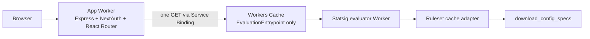

# Cloudflare Workers reference application

This repository implements the two-Worker architecture in
`IMPLEMENTATION_PLAN.md`:

- Vite 8 and React Router 8 framework-mode SSR.
- `@cloudflare/vite-plugin` as the only Vite-to-Workers integration.
- Express 4 bridged to Workers with `httpServerHandler`.
- The literal `next-auth` v4 package through an Express adapter.
- One Statsig Service Binding `fetch()` for each authenticated SSR request.
- A private named evaluator entrypoint with Workers Cache enabled.
- HMAC-partitioned per-user bootstrap responses.
- A typed custom evaluator and `@statsig/js-client` bootstrap validation.
- Preview configuration that binds app Previews to the staging evaluator's
  production deployment.

## Important experimental prerequisite

Wrangler 4.114.0 does not expose the workerd `MemoryCache` binding in its
configuration schema or generated types. The evaluator therefore uses
`IsolateVolatileValueCache`, a narrow compatibility implementation of
`read(key, fallback)` with concurrent fallback coalescing.

This fallback is intentionally labeled in `/health` and is **not** claimed to
be process-local Volatile Cache. Do not deploy this reference as production
complete until a supported Wrangler release exposes MemoryCache without
`unsafe.bindings`; then replace the adapter in
`workers/statsig/ruleset-cache.ts`, regenerate types, and rerun the documented
30 MB benchmark.

The current workerd Node HTTP bridge also does not deliver incremental
`ServerResponse.write()` chunks from `@react-router/express` to the outer Fetch
response. `workers/app/server.ts` contains a narrowly scoped body bridge that
buffers only React Router document responses and passes the completed body to
`response.end()`. SSR, actions, redirects, errors, hydration, and HMR work
locally, but true incremental SSR streaming remains a documented runtime
compatibility gate rather than a completed claim.

## Architecture



The app Worker and evaluator default/admin entrypoint have Workers Cache
disabled. Only `EvaluationEntrypoint` has cache enabled. The repository contains
a guard that rejects `caches.default` and `caches.open()`.

## Local setup

1. Install dependencies:

   ```sh
   npm ci
   ```

2. Create local secrets:

   ```sh
   cp .dev.vars.example .dev.vars
   npm run hash-password -- 'choose-a-demo-password'
   ```

   Copy the generated value into `DEMO_PASSWORD_HASH`.
   Keep `NEXTAUTH_URL` aligned with the local Vite URL shown in the terminal.

3. Start both Workers through the Cloudflare Vite plugin:

   ```sh
   npm run dev
   ```

4. Open the displayed local URL. Use `/api/auth/signin` to authenticate.

The `next` package is installed only to satisfy `next-auth` v4's declared peer
dependency. The Worker code uses the API-handler path from `next-auth`; build
checks verify that the application can bundle without importing a Next.js
server runtime entrypoint.

## Request and cache behavior

For an authenticated SSR request:

1. Express calls `getServerSession()` once.
2. The app constructs a minimized canonical Statsig user.
3. It creates a versioned HMAC-SHA-256 path key.
4. It sends one Service Binding `GET` with the canonical user in an internal
   header. Browser cookies and authorization headers are never forwarded.
5. Workers Cache keys the response by the named entrypoint and HMAC path.
6. The app validates the evaluator response with Zod and places it in React
   Router load context.
7. The document emits safely escaped bootstrap JSON. The browser client calls
   `initializeSync()` with all Statsig network traffic disabled.

All app, admin, error, and authentication responses use
`Cache-Control: private, no-store`. Successful evaluator responses use a short
public TTL, stale-while-revalidate, and a per-application cache tag.

## Statsig compatibility envelope

The evaluator supports the operators and condition types returned by
`supportedCompatibilityEnvelope()` in `workers/statsig/evaluator.ts`. Unknown
constructs fail closed. It emits the V1 initialize containers and metadata
required by the pinned `@statsig/js-client` version.

Before using a real project:

1. Capture its `download_config_specs` response outside this repository.
2. Inventory its condition types and operators.
3. Add production-shaped fixtures and golden outputs generated by an official
   Statsig implementation.
4. Run:

   ```sh
   npm run benchmark:ruleset -- /path/to/ruleset.json
   npm run test:run
   ```

Exposure-event delivery is intentionally omitted.

## Verification

```sh
npm run cf-typegen
npm run typecheck
npm run test:run
npm run guard:no-cache-api
npm run build
npx wrangler deploy --dry-run
npx wrangler deploy --dry-run --config wrangler.statsig.jsonc
```

## Deployment order

1. Deploy `reference-example-kitchen-sink-statsig-staging`:

   ```sh
   npm run deploy:statsig:staging
   ```

2. Configure its Statsig, HMAC, and refresh secrets.
3. Push app Preview base configuration and Preview-specific auth secrets.
4. Create the app Preview.
5. Deploy the production evaluator.
6. Deploy the production app.

The production app binds the production evaluator. App Previews bind the
**production deployment of the separate staging evaluator**. A Service Binding
on a Worker Preview cannot target another Worker's Preview, so evaluator
changes must be deployed compatibly to staging before end-to-end app Preview
testing.

Example Preview setup:

```sh
npx wrangler preview base-config secret put AUTH_SECRET
npx wrangler preview base-config secret put NEXTAUTH_URL
npx wrangler preview base-config secret put DEMO_USERNAME
npx wrangler preview base-config secret put DEMO_PASSWORD_HASH
npx wrangler preview base-config secret put USER_CACHE_HMAC_SECRET
npx wrangler preview base-config push
npx wrangler preview
```

Protect public Preview URLs with Cloudflare Access and use non-production demo
credentials.

## Troubleshooting

- `Cf-Cache-Status` remains `MISS`: verify cache is enabled for
  `EvaluationEntrypoint`, the request is `GET`, and no `Authorization` header is
  forwarded.
- Authentication cookies are missing: verify the proxy scheme/host and use
  HTTPS outside local development.
- Evaluator returns `503`: inspect structured logs for ruleset validation,
  timeout, or source failures.
- Ruleset memory is too high: benchmark raw, normalized, and Brotli
  representations and request explicit memory/Volatile Cache limits before
  deployment.
