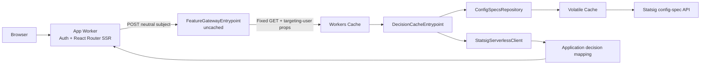

# Cloudflare Workers reference application

This repository is a deployable two-Worker reference for:

- Vite 8 and React Router 8 framework-mode SSR.
- Native Fetch request handling and streaming Web `Response` bodies.
- Literal `next-auth` 4.24.15 through a narrow compatibility capsule.
- A vendor-neutral, private feature service reached through a Service Binding.
- Workers Cache partitioned by per-user `ctx.props`.
- Statsig as an evaluator-owned implementation detail.
- Volatile Cache for large raw Statsig config specs.
- Official server-side evaluation through `@statsig/serverless-client` 3.33.3.

The browser and application Worker contain no Statsig SDK, key, targeting-user
shape, gate name, or config name.

## Experimental prerequisites

The evaluator uses workerd's process-local Volatile Cache through an
experimental `unsafe.bindings` entry. Local Vite development depends on the
Wrangler prerelease built from
[cloudflare/workers-sdk#14868](https://github.com/cloudflare/workers-sdk/pull/14868).
The package override in `package.json` also forces the Cloudflare Vite plugin to
use that PR's Miniflare build.

Wrangler does not yet expose this binding in its public schema or generated
types, so `types/statsig-config-specs-cache.d.ts` supplies the narrow
`read(key, fallback)` contract. The configured 64 MiB per-value and 128 MiB
total limits must be validated against a representative config-specs payload.

## Architecture



The evaluator exports three entrypoints:

| Entrypoint | Purpose | Workers Cache |
| --- | --- | --- |
| `default` | Health | Disabled |
| `FeatureGatewayEntrypoint` | Validate and normalize neutral subjects | Disabled |
| `DecisionCacheEntrypoint` | Evaluate and cache application decisions | Enabled |

The gateway invokes the decision entrypoint through
`ctx.exports.DecisionCacheEntrypoint({ props }).fetch()`.

## Feature boundary

The shared contract in `shared/feature-contract.ts` contains only application
concepts:

```ts
{
  showReferenceExperience: boolean;
  welcomeMessage: string;
}
```

For each authenticated SSR request, the app makes exactly one
`FEATURE_SERVICE` request containing only the user's ID and optional normalized
email. The Statsig Worker adds trusted application, tenant, and environment
attributes, passes the validated targeting user through typed entrypoint props,
loads the current config specs, and maps provider results to the application
contract.

## Cache behavior

The internal cache request uses one fixed URL. Workers Caching includes the
full normalized targeting user from `ctx.props` in the cache key, so user IDs
and email addresses never appear in cache URLs or structured logs.

Successful decision responses use:

```http
Cache-Control: public, max-age={DECISIONS_TTL_SECONDS}, stale-while-revalidate={DECISIONS_STALE_SECONDS}
```

App, gateway, health, auth, SSR, validation-error, and evaluation-error
responses are uncached. The config-specs repository keeps one initialized
server client per configuration generation, preserves absolute expiry, and
falls back to its last-known-good snapshot when refresh fails.

Configuration and decision changes propagate through their bounded TTLs.
There is no manual invalidation endpoint because isolate-local repository state
and the entrypoint cache do not share an atomic invalidation boundary.

## Local setup

1. Install dependencies:

   ```sh
   pnpm install --frozen-lockfile
   ```

2. Create local secrets:

   ```sh
   cp .dev.vars.example .dev.vars
   pnpm run hash-password -- 'choose-a-demo-password'
   ```

   Copy the generated value into `DEMO_PASSWORD_HASH`. The shared local
   `.dev.vars` file supplies both auxiliary Workers, but
   `STATSIG_SERVER_SECRET` belongs only to the evaluator in deployed
   environments.

3. Start both Workers:

   ```sh
   pnpm run dev
   ```

4. Open the displayed URL and use `/api/auth/signin`.

## Verification

```sh
pnpm run cf-typegen
pnpm run check
pnpm run build
pnpm exec wrangler deploy --dry-run
pnpm exec wrangler deploy --dry-run --config wrangler.statsig.jsonc
```

## Deployment order

1. Deploy the staging evaluator.
2. Configure the evaluator's Statsig server secret.
3. Push app Preview configuration and auth secrets.
4. Create or update the app Preview.
5. Deploy the production evaluator.
6. Deploy the production app.

App Previews bind the production deployment of the separate staging evaluator,
so evaluator changes must reach staging before the app Preview is created.

## Troubleshooting

- Repeated `Cf-Cache-Status: MISS`: verify the app targets
  `FeatureGatewayEntrypoint`, the gateway loopback targets
  `DecisionCacheEntrypoint` with targeting-user `ctx.props`, and the fixed
  inner request contains no cookie or authorization header.
- Missing auth cookies: verify proxy scheme/host and use HTTPS outside local
  development.
- Evaluator `503`: inspect structured logs for download, timeout,
  config-specs initialization, or decision evaluation failures.
- High config-specs memory usage: benchmark representative config specs before
  deployment.
