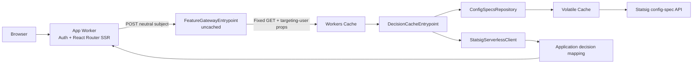

# Cloudflare Workers reference application

This repository is a deployable two-Worker reference for:

- Vite 8 and React Router 8 framework-mode SSR.
- Native Fetch request handling and streaming Web `Response` bodies.
- Literal `next-auth` 4.24.15 through a narrow compatibility capsule.
- A vendor-neutral, private feature service reached through a Service Binding.
- Workers Cache partitioned by per-user `ctx.props`.
- Statsig as an evaluator-owned implementation detail.
- Volatile Cache for large raw Statsig config specs.
- Official server-side evaluation through `@statsig/serverless-client` 3.33.3.

The browser and application Worker contain no Statsig SDK, key, targeting-user
shape, gate name, or config name.

## Experimental prerequisites

The evaluator uses workerd's process-local Volatile Cache through an
experimental `unsafe.bindings` entry. Local Vite development depends on the
Wrangler prerelease built from
[cloudflare/workers-sdk#14868](https://github.com/cloudflare/workers-sdk/pull/14868).
The package override in `package.json` also forces the Cloudflare Vite plugin to
use that PR's Miniflare build.

Wrangler does not yet expose this binding in its public schema or generated
types, so `types/statsig-config-specs-cache.d.ts` supplies the narrow
`read(key, fallback)` contract. The configured 64 MiB per-value and 128 MiB
total limits must be validated against a representative config-specs payload.

## Architecture



The evaluator exports three entrypoints:

| Entrypoint | Purpose | Workers Cache |
| --- | --- | --- |
| `default` | Health | Disabled |
| `FeatureGatewayEntrypoint` | Validate and normalize neutral subjects | Disabled |
| `DecisionCacheEntrypoint` | Evaluate and cache application decisions | Enabled |

The gateway invokes the decision entrypoint through
`ctx.exports.DecisionCacheEntrypoint({ props }).fetch()`.

## Feature boundary

The shared contract in `shared/feature-contract.ts` contains only application
concepts:

```ts
{
  showReferenceExperience: boolean;
  welcomeMessage: string;
}
```

Authenticated loaders that need decisions call a request-scoped, memoized
feature loader. Rendering `/` or `/protected` therefore makes at most one
`FEATURE_SERVICE` request containing only the user's ID and optional normalized
email. Health, auth, sign-in, and anonymous requests do not call the feature
service. The Statsig Worker adds trusted application, tenant, and environment
attributes, passes the validated targeting user through typed entrypoint props,
loads the current config specs, and maps provider results to the application
contract.

`scripts/guard-feature-boundary.mjs`, which runs as part of `pnpm run check`,
prevents provider names and imports from appearing under `app/`, `workers/app/`,
or `shared/`.

## Cache behavior

The internal cache request uses one fixed URL, so user IDs and email addresses
do not appear in cache URLs. Workers Caching separately includes the full
normalized targeting user from `ctx.props` in the cache key, which partitions
cached responses by user. Structured evaluation logs deliberately omit the
targeting user.

Successful decision responses use:

```http
Cache-Control: public, max-age={DECISIONS_TTL_SECONDS}, stale-while-revalidate={DECISIONS_STALE_SECONDS}
```

App, gateway, health, auth, SSR, validation-error, and evaluation-error
responses are uncached. The config-specs repository reuses its initialized
server client while the configuration generation is unchanged, preserves the
absolute expiry returned by the Volatile Cache, and falls back to its
last-known-good snapshot when refresh fails.

Configuration and decision changes propagate through their bounded TTLs.
This reference intentionally uses TTL convergence instead of a best-effort
manual purge: isolate-local repository state and the entrypoint cache cannot be
invalidated together atomically.

## Local setup

Use Node.js 24 and the repository-pinned pnpm 11 release.

1. Install dependencies:

   ```sh
   pnpm install --frozen-lockfile
   ```

2. Create local secrets:

   ```sh
   cp .dev.vars.example .dev.vars
   pnpm run hash-password -- 'choose-a-demo-password'
   ```

   Copy the generated value into `DEMO_PASSWORD_HASH`. The shared local
   `.dev.vars` file supplies both auxiliary Workers, but
   `STATSIG_SERVER_SECRET` belongs only to the evaluator in deployed
   environments.

3. Start both Workers:

   ```sh
   pnpm run dev
   ```

4. Open the displayed URL and use `/api/auth/signin`.

## Verification

```sh
pnpm run cf-typegen
pnpm run check
pnpm run build
pnpm exec wrangler deploy --dry-run
pnpm exec wrangler deploy --dry-run --config wrangler.statsig.jsonc --env=""
```

Benchmark a representative production config-specs document before selecting
Volatile Cache limits:

```sh
pnpm run benchmark:config-specs -- /path/to/config-specs.json
```

## Preview deployments

Cloudflare Workers Previews are the primary change-review workflow for this
repository. Start with the
[Workers Previews get-started guide](https://worker-previews-docs-2.preview.developers.cloudflare.com/workers/previews/get-started/).
The feature is currently private beta in the Wrangler prerelease pinned by this
repository, so re-check that guide and `pnpm exec wrangler preview --help` when
updating Wrangler.

A Preview is an isolated branch deployment of the **app Worker**:

- Its stable Preview URL always serves the newest deployment for that Preview.
- Each update also has an immutable Deployment URL pinned to that exact build.
- Preview variables, secrets, and bindings are independent from production;
  they are not inherited automatically.
- Reusing a Preview name updates the same Preview and preserves its stable URL.
- Closing the pull request should delete the Preview and its deployments.

The app's `previews` block in `wrangler.jsonc` deliberately binds
`FEATURE_SERVICE` to
`reference-example-kitchen-sink-statsig-staging`. A service binding from a
Preview always invokes the bound Worker's production deployment; it cannot
target another Worker's Preview. In this architecture, "production deployment
of the staging evaluator Worker" is the safe shared backend for every app
Preview. Deploy evaluator changes there before creating or refreshing an app
Preview that depends on them.

The Preview app uses `AUTH_TRUST_HOST=true`, allowing NextAuth to construct its
origin from the current Preview request rather than a single static
`NEXTAUTH_URL`. This is what allows every PR Preview URL to complete the auth
flow. The Worker must continue to receive trustworthy host and protocol
headers.

### One-time Cloudflare setup

1. Authenticate Wrangler locally, or create a CI API token with permission to
   manage this Worker and its Previews.
2. Configure and deploy the staging evaluator. Required secrets must exist
   before deployment validation succeeds:

   ```sh
   pnpm exec wrangler secret put STATSIG_SERVER_SECRET \
     --config wrangler.statsig.jsonc \
     --env staging
   pnpm run deploy:statsig:staging
   ```

3. Configure the production app secrets and create its production Worker:

   ```sh
   pnpm exec wrangler secret put AUTH_SECRET
   pnpm exec wrangler secret put DEMO_USERNAME
   pnpm exec wrangler secret put DEMO_PASSWORD_HASH
   pnpm run deploy:app
   ```

4. Push the app's Preview settings, then configure the three Preview secrets
   separately from production:

   ```sh
   pnpm exec wrangler preview settings update
   pnpm exec wrangler preview secret put AUTH_SECRET
   pnpm exec wrangler preview secret put DEMO_USERNAME
   pnpm exec wrangler preview secret put DEMO_PASSWORD_HASH
   ```

   The pinned Wrangler currently calls the shared Preview configuration
   `settings`; the linked beta documentation describes this concept as the
   Preview base configuration. Use `preview settings update` again when the
   checked-in `previews` block changes and existing/new Previews should receive
   that base configuration.

5. Add `CLOUDFLARE_API_TOKEN` and `CLOUDFLARE_ACCOUNT_ID` as GitHub Actions
   repository secrets. Commit `.github/workflows/preview.yml` to the default
   branch.
6. Consider protecting Preview and Deployment URLs with Cloudflare Access.
   Preview URLs are otherwise public.

### Pull request workflow

The GitHub Actions workflow uses the deterministic Preview name
`pr-<pull-request-number>`:

1. Open or reopen a same-repository pull request.
2. CI installs dependencies, type-checks, tests, verifies the provider boundary,
   and builds both Workers.
3. `wrangler preview --name pr-<number>` creates or updates the app Preview.
4. CI creates or updates one pull-request comment containing:
   - the stable PR Preview URL for normal review; and
   - the immutable Deployment URL for comparing a specific commit.
5. Push another commit. CI updates the same Preview, so reviewers keep using the
   same stable URL while the immutable URL changes.
6. Merge or close the pull request. The cleanup job deletes
   `pr-<number>` and all deployments under it.

GitHub does not expose repository secrets to untrusted fork pull requests, so
the workflow intentionally skips those PRs. Test a fork locally or move the
change to a trusted branch before creating a Cloudflare Preview; do not switch
to `pull_request_target` and execute untrusted code with deployment credentials.

You can run the same lifecycle manually:

```sh
pnpm run check
pnpm run build
pnpm exec wrangler preview --name my-branch
pnpm exec wrangler preview delete --name my-branch --skip-confirmation
```

When a branch needs different variables, bindings, or test resources, modify
the `previews` block for settings that should travel with the branch, or change
that individual Preview in the dashboard. Previews that point to the same
external resource share its data. Keep Preview credentials and bindings pointed
at staging/test systems unless production access is an explicit part of the
test.

## Production release workflow

1. Deploy evaluator changes to the staging evaluator.
2. Create or update the app Preview and exercise auth, SSR, feature evaluation,
   cache hits, stale behavior, and failure paths.
3. Merge only after the stable Preview represents the approved commit.
4. Configure the production evaluator secret if this is its first deployment:

   ```sh
   pnpm exec wrangler secret put STATSIG_SERVER_SECRET \
     --config wrangler.statsig.jsonc \
     --env=""
   ```

5. Deploy the production evaluator before the production app:

   ```sh
   pnpm run deploy:statsig
   pnpm run deploy:app
   ```

The evaluator-first order ensures the app never ships against a feature-service
contract that its production binding cannot yet satisfy.

## Troubleshooting

- Repeated `Cf-Cache-Status: MISS`: verify the app targets
  `FeatureGatewayEntrypoint`, the gateway loopback targets
  `DecisionCacheEntrypoint` with targeting-user `ctx.props`, and the fixed
  inner request contains no cookie or authorization header.
- Missing auth cookies: verify proxy scheme/host and use HTTPS outside local
  development. For Previews, also confirm `AUTH_TRUST_HOST=true` is present in
  Preview settings and that no stale `NEXTAUTH_URL` Preview secret overrides
  the request origin.
- Preview deploy reports missing bindings or secrets: Previews do not inherit
  production settings. Re-run `preview settings update`, list Preview secrets,
  and compare the active Preview settings with `wrangler.jsonc`.
- Preview app reaches the wrong evaluator: service bindings target the bound
  Worker's production deployment. Confirm the Preview binding names the
  separate `reference-example-kitchen-sink-statsig-staging` Worker.
- Evaluator `503`: inspect structured logs for download, timeout,
  config-specs initialization, or decision evaluation failures.
- High config-specs memory usage: run `pnpm run benchmark:config-specs` against
  a representative payload and revisit the configured per-value and total
  Volatile Cache limits.
