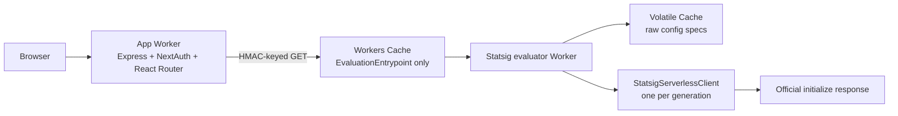

# Cloudflare Workers reference application

This repository is a deployable two-Worker reference for:

- Vite 8 and React Router 8 framework-mode SSR.
- Express 4 bridged to Workers with `httpServerHandler`.
- Literal `next-auth` 4.24.15 through a narrow compatibility capsule.
- A private Statsig evaluator reached through a Service Binding.
- Workers Cache for HMAC-partitioned per-user bootstrap responses.
- Volatile Cache for large raw Statsig config specs.
- Official evaluation through `@statsig/serverless-client` 3.33.3.
- Public `@statsig/js-client` bootstrap initialization with zero browser
  Statsig network traffic.

See `IMPLEMENTATION_PLAN.md` for the detailed design.

## Experimental prerequisites

The evaluator uses workerd's process-local `MemoryCache` through an experimental
`unsafe.bindings` `volatile_cache` entry. Local Vite development depends on the
Wrangler prerelease built from
[cloudflare/workers-sdk#14868](https://github.com/cloudflare/workers-sdk/pull/14868).

Wrangler does not yet expose this binding in its public schema or generated
types, so `types/statsig-memory-cache.d.ts` supplies the narrow
`read(key, fallback)` and `delete(key)` contract. The configured 64 MiB
per-value and 128 MiB total limits must be validated against the representative
30 MB ruleset. KV is intentionally not used because
[Workers KV limits values to 25 MiB](https://developers.cloudflare.com/kv/platform/limits/).

The current workerd Node HTTP bridge also does not deliver incremental
`ServerResponse.write()` chunks from `@react-router/express` to the outer Fetch
response. `workers/app/compat/react-router-document-response.ts` buffers only
React Router document requests. Data responses and other Express routes retain
normal response behavior. The isolated reproduction is in
`repro/http-server-streaming/`.

## Architecture



The app Worker and evaluator default/admin entrypoint have Workers Cache
disabled. Only `EvaluationEntrypoint` has it enabled. A repository guard rejects
use of `caches.default` and `caches.open()`.

The evaluator deliberately does not use `@statsig/serverless-client/cloudflare`,
`handleWithStatsig`, `StatsigCloudflareClient.initializeFromKV()`, or Statsig's
prescribed KV lifecycle.

## Local setup

1. Install dependencies:

   ```sh
   npm ci
   ```

2. Create local secrets:

   ```sh
   cp .dev.vars.example .dev.vars
   npm run hash-password -- 'choose-a-demo-password'
   ```

   Copy the generated value into `DEMO_PASSWORD_HASH`. Keep `NEXTAUTH_URL`
   aligned with the local Vite URL.

3. Start both Workers:

   ```sh
   npm run dev
   ```

4. Open the displayed URL and use `/api/auth/signin`.

The `next` package only satisfies `next-auth` v4's peer dependency. NextAuth
interop, request adaptation, response method binding, and cookie preservation
are isolated in `workers/app/compat/next-auth-bridge.ts`. The exact pinned
version is covered by a contract test.

## Request and cache behavior

For an authenticated SSR request:

1. Express loads the NextAuth session once.
2. The app creates a minimized canonical Statsig user.
3. It creates a versioned HMAC-SHA-256 path key.
4. It sends one credential-free Service Binding `GET`.
5. Workers Cache keys the response by the named entrypoint and HMAC path.
6. On a miss, the evaluator loads the current raw config specs from Volatile
   Cache or Statsig.
7. The isolate-local `StatsigServerlessClient` generates the official bootstrap
   response.
8. The app validates and embeds the response in the SSR document.
9. The browser calls the public `client.dataAdapter.setData()` API followed by
   `initializeSync()`, with all network traffic disabled.

Successful evaluator responses use a short public TTL, stale-while-revalidate,
and an application cache tag. App, auth, admin, and error responses are
`private, no-store`.

## Ruleset lifecycle

Ruleset freshness uses absolute TTL expiry. The runtime snapshot retains the
initialized client and generation, not the raw JSON string. When the generation
changes, the isolate-local client is replaced.

There is no refresh cron. For immediate invalidation:

```sh
curl -X POST \
  -H "Authorization: Bearer $INVALIDATION_SECRET" \
  https://<private-admin-host>/admin/invalidate
```

The endpoint deletes the Volatile Cache key and clears local evaluator state.
The next evaluator invocation after the per-user Workers Cache entry expires
downloads current config specs; existing bootstrap entries retain their normal
TTL and stale window.

## Verification

```sh
npm run cf-typegen
npm run check
npm run build
npx wrangler deploy --dry-run
npx wrangler deploy --dry-run --config wrangler.statsig.jsonc
```

For a production-shaped ruleset:

```sh
npm run benchmark:ruleset -- /path/to/ruleset.json
```

## Deployment order

1. Deploy the staging evaluator:

   ```sh
   npm run deploy:statsig:staging
   ```

2. Configure `STATSIG_SERVER_SECRET`, `USER_CACHE_HMAC_SECRET`, and
   `INVALIDATION_SECRET`.
3. Push app Preview base configuration and Preview auth secrets.
4. Create the app Preview.
5. Deploy the production evaluator.
6. Deploy the production app.

App Previews bind the production deployment of the separate staging evaluator.
A Service Binding on a Worker Preview cannot target another Worker's Preview,
so evaluator changes must reach staging first.

## Troubleshooting

- Repeated `Cf-Cache-Status: MISS`: verify Workers Cache is enabled for
  `EvaluationEntrypoint`, the request is `GET`, and no `Authorization` or cookie
  header is forwarded.
- Missing auth cookies: verify proxy scheme/host and use HTTPS outside local
  development.
- Evaluator `503`: inspect structured logs for download, timeout, config-spec
  initialization, or bootstrap validation failures.
- High ruleset memory: benchmark the representative ruleset and confirm
  isolate and Volatile Cache limits before deployment.
