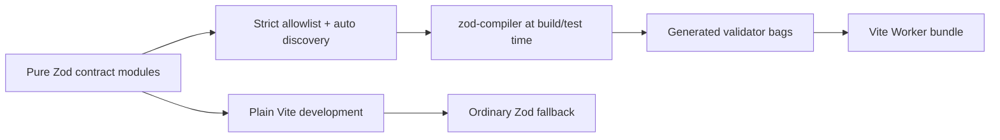

# Build-time Zod schema compilation

## Decision

Zod remains the schema authoring language, but production Workers and the main
Vitest suite compile the approved schema modules with `zod-compiler` 1.18.0.
Compiled exports use `output: "bag"` and `stripUnknownKeys: true`.

The approved modules are:

- `shared/feature-contract.ts`
- `workers/statsig/provider-contract.ts`
- `workers/statsig/targeting-user-contract.ts`

These modules export six schema roots. `pnpm run check:zod-compiler` requires
100% compiler coverage for all six.

## Why raw Zod is costly in Workers

A raw top-level `z.object()` expression constructs a graph of schema objects
when an isolate starts. That work has two costs:

1. The Worker must parse the bundled implementation and execute schema
   constructors before it can handle a request.
2. The isolate retains the schema graph for its lifetime.

Cloudflare currently requires a Worker to parse and execute global scope within
one second. Its limits documentation specifically recommends moving large
schema generation from global scope to build time:

- <https://developers.cloudflare.com/workers/platform/limits/#worker-startup-time>

Memory is shared by concurrent requests handled by an isolate. Local heap
snapshots can be captured through Workers DevTools:

- <https://developers.cloudflare.com/workers/observability/dev-tools/memory-usage/>

## Build flow



`compiledZodSchemas()` is the first plugin in the app build, Statsig-only build,
unit-test build, and Workers-runtime test build. The Vite plugin defaults to
compiling production builds and Vitest runs while leaving the ordinary
development server on the raw Zod fallback.

## Option rationale

### `schemas: "auto"`

Automatic discovery compiles exported schemas without adding compiler wrappers
to application source. It also handled the composed shared schemas more
reliably in the migration prototype.

Auto mode executes candidate modules to inspect their exports. The `include`
allowlist therefore limits discovery to the three pure contract modules. Those
modules must not perform I/O, validate environment variables, initialize SDK
clients, or otherwise execute application behavior at module scope.

### `output: "bag"`

The default compiler output retains the original Zod schema. Bag output replaces
each compiled export with a small object containing the validation methods used
by this project, allowing the original schema construction graph to be removed.

Bag exports are not full Zod schema objects. Code may use `parse()`,
`safeParse()`, and their compiled-compatible result/error behavior, but must not
depend on schema introspection such as `.shape`, `._zod`, `instanceof
ZodObject`, registries, or JSON Schema conversion.

### `stripUnknownKeys: true`

Raw `z.object()` strips unknown properties by default. The compiler otherwise
keeps a valid object by reference for speed. Enabling `stripUnknownKeys`
preserves the existing sanitization behavior at request, response, diagnostic,
provider configuration, and targeting-user object boundaries.

## Source layout

Provider schemas are separated from modules with behavior:

- `provider-contract.ts` owns `welcomeConfigSchema`.
- `targeting-user-contract.ts` owns `targetingUserSchema` and its inferred type.
- `decision-evaluator.ts` and `statsig-user.ts` import those contracts.

This prevents compiler discovery from executing the feature evaluator or
Statsig client initialization paths.

## Test behavior

`vitest.config.mts` and `vitest.workers.config.mts` install the compiler before
other plugins, so normal tests exercise compiled validators.

`vitest.zod-fallback.config.mts` intentionally omits the plugin and runs the
same schema behavior suite against ordinary Zod. The suite verifies:

- subject trimming and email normalization;
- unknown-key stripping at every object boundary;
- valid and invalid `safeParse()` shapes;
- compatible `ZodError` failures from `parse()`;
- malformed response diagnostics;
- malformed provider configuration and targeting users; and
- the expected compiled-bag versus raw-Zod runtime shape.

The compiler configuration itself is unit-tested to prevent accidental changes
to output mode, unknown-key handling, or the discovery allowlist.

## Measurements

The controlled migration prototype produced:

| Worker artifact | Raw Zod gzip | Compiled gzip | Change |
| --- | ---: | ---: | ---: |
| App `build/server/index.js` | 164,700 B | 143,406 B | -12.9% |
| Statsig `dist/reference_example_kitchen_sink_statsig/index.js` | 69,697 B | 67,300 B | -3.4% |

The final staged build was measured again on July 26, 2026:

| Worker artifact | Raw bytes | Gzip bytes | Bundled Zod modules |
| --- | ---: | ---: | ---: |
| App `build/server/index.js` | 714,511 B | 143,418 B | 4 |
| Statsig `dist/reference_example_kitchen_sink_statsig/index.js` | 341,279 B | 67,326 B | 16 |

Reproduce the current measurements with:

```sh
pnpm run measure:worker-bundles
pnpm run measure:worker-bundles:json
```

The script reports raw size, gzip size, and unique bundled Zod modules. JSON
output is stable enough for CI comparison.

The migration prototype also measured a synthetic schema-only Node import
benchmark:

- median module import: 9.73 ms to 2.86 ms;
- retained heap delta: 1.79 MB to 0.54 MB.

That benchmark supports the expected mechanism but is not a workerd production
measurement. Before/after staging deployments should still record Wrangler's
`startup_time_ms` and DevTools heap snapshots after startup and representative
requests.

## Deployment requirements

The Cloudflare Vite plugin writes each auxiliary Worker to its own `dist`
subdirectory, and Cloudflare requires auxiliary Workers to be deployed
individually from their generated configuration:

- <https://developers.cloudflare.com/workers/vite-plugin/reference/api/>

Use:

```sh
pnpm run deploy:statsig
pnpm run deploy:statsig:staging
pnpm run deploy:app
pnpm run deploy
```

Do not run `wrangler deploy --config wrangler.statsig.jsonc`. That path bundles
the source Worker directly and bypasses `zod-compiler`.

`scripts/build-statsig.mjs` preserves and restores
`.wrangler/deploy/config.json` around a standalone feature-service build. This
avoids leaving a generated Statsig redirect behind that could cause a later
bare `wrangler deploy` to target the wrong Worker. The behavior matches
Wrangler's generated-configuration model:

- <https://developers.cloudflare.com/workers/wrangler/configuration/#generated-wrangler-configuration>

## Adding or changing schemas

1. Keep schema definitions in a pure contract module.
2. Export each schema root that must be compiled.
3. Add a new contract module to the `include` list in
   `zod-compiler.config.ts`.
4. Add compiled and fallback behavior tests, especially for normalization,
   transformations, errors, and unknown properties.
5. Run:

   ```sh
   pnpm run check:zod-compiler
   pnpm run check
   pnpm run build
   pnpm run measure:worker-bundles
   ```

If a consumer needs schema introspection rather than validation methods, do not
silently add that usage to a bag export. Revisit the output decision and measure
the bundle/startup tradeoff.

## Compiler upgrades

1. Pin the candidate `zod-compiler` version exactly.
2. Read its release notes and option/behavior documentation.
3. Run the 100% coverage check and both compiled and fallback suites.
4. Compare generated Worker bundles with the committed baseline above.
5. Deploy the feature service to staging and record `startup_time_ms`.
6. Capture comparable DevTools heap snapshots.
7. Exercise normalization, validation, cache, and failure paths before
   production rollout.

Some Zod error and configuration machinery remains bundled because compiled
bags preserve compatible validation errors. A compiler upgrade should not be
accepted solely because schema constructors disappear.

## Rollback

To roll back:

1. Remove the compiler plugin from every Vite and Vitest configuration.
2. Restore direct Statsig build/deploy behavior only after confirming it
   intentionally ships raw Zod.
3. Remove the compiler dependency, configuration, coverage check, and fallback
   mode assertion.
4. Rebuild and run the full verification suite.
5. Deploy the feature service first, followed by the app.

The source contracts remain ordinary Zod throughout, so rollback does not
require rewriting application validation code.
