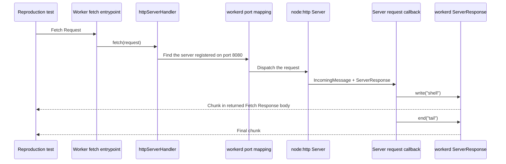

# `httpServerHandler` streaming reproduction

This directory isolates one question:

> Can a Node-style HTTP response stream through `httpServerHandler` in the same
> way under Node.js and workerd?

It removes Express, React, authentication, and the reference application from
the request path. The remaining code uses `node:http`,
`httpServerHandler`, and React Router's stream-writing helper.

## Where `ServerResponse` comes from

The reproduction creates a server with `node:http.createServer()`. The callback
receives two familiar Node objects:

```ts
createServer((request, response) => {
	// request is an IncomingMessage
	// response is a ServerResponse
});
```

Under regular Node.js, Node provides those objects. Inside a Cloudflare Worker,
workerd provides Node-style implementations of the supported APIs, backed by
the Workers Fetch and Streams APIs. The application creates the server and
writes the response, but it does not implement `ServerResponse`. The
reproduction exists because the supported surface does not currently behave
identically to Node for this response lifecycle.

`server.listen(8080)` also has a different job in this environment. It registers
the Node-style server with workerd's internal port mapping; it does not expose a
new public TCP server. `httpServerHandler({ port: 8080 })` returns the Worker's
Fetch handler and forwards each incoming Worker request to that registered
server. See the [`httpServerHandler` implementation](https://github.com/cloudflare/workerd/blob/main/src/cloudflare/node.ts)
and the [Workers Node.js HTTP documentation](https://developers.cloudflare.com/workers/runtime-apis/nodejs/http/).

## Incoming request flow



Think of the full path as an in-process adapter chain. `httpServerHandler`
locates the server registered for a port and forwards the Fetch request.
workerd's `Server`, `IncomingMessage`, and `ServerResponse` implementations
adapt between the Node HTTP API and Fetch `Request`, `Response`, and
`ReadableStream`. Unlike a traditional proxy, this adaptation does not involve
a separate network service.

## What the reproduction tests

The server exposes two endpoints:

- `/raw` calls `ServerResponse.write()` directly.
- `/react-router-writer` passes a Web `ReadableStream` to
  `@react-router/node`'s `writeReadableStreamToWritable()`.

Both endpoints produce an HTML shell immediately and schedule a tail 500
milliseconds later. The raw endpoint writes both pieces successfully. Under
Node.js, the React Router writer also writes both pieces; under the pinned
workerd runtime, the early `close` event interrupts that writer before it can
complete. Receiving the shell before the delay expires proves that the returned
Fetch response exposes the shell before the scheduled tail and before `end()`.

This reproduction stops at the returned Fetch response body. It does not test
whether a deployed Cloudflare network path or a particular HTTP client adds its
own buffering. workerd may also buffer writes made before response headers are
sent; that is separate from the incremental behavior tested here.

## Run the comparison

```sh
cd repro/http-server-streaming
npm ci
npm test
```

The Node baseline expects both endpoints to stream. It also observes that no
`close` event is emitted before `ServerResponse.end()`.

The workerd tests use the runtime pinned by this reproduction. The direct
`ServerResponse.write()` test passes, which shows that the underlying adapter
can stream. Two additional tests assert the currently observed mismatch:

1. the reproduction observes a `close` event before `end()`;
2. React Router interprets that event as an interrupted writable and stops
   pumping the body. The runtime also logs a closed
   `ReadableByteStreamController` when the delayed source attempts its next
   write.

The relevant runtime behavior is in workerd's
[`ServerResponse` implementation](https://github.com/cloudflare/workerd/blob/main/src/node/internal/internal_http_server.ts).
React Router's corresponding behavior is in
[`writeReadableStreamToWritable()`](https://github.com/remix-run/react-router/blob/main/packages/react-router-node/stream.ts).
Node documents the meaning of the response events in its
[`ServerResponse` API](https://nodejs.org/api/http.html#class-httpserverresponse).

When the lifecycle behavior is aligned, invert those current-behavior
assertions so the workerd suite expects the same successful result as the Node
baseline.
